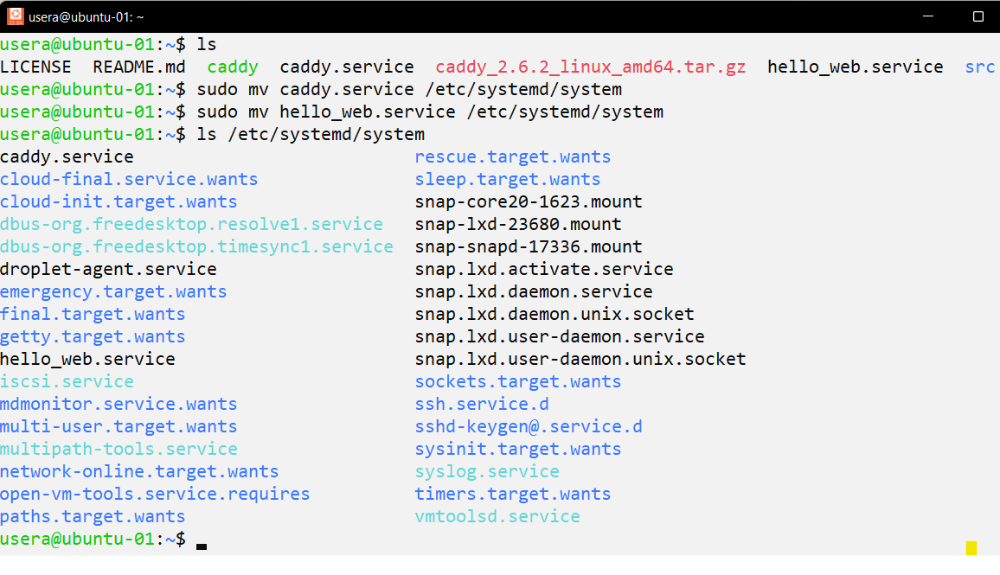
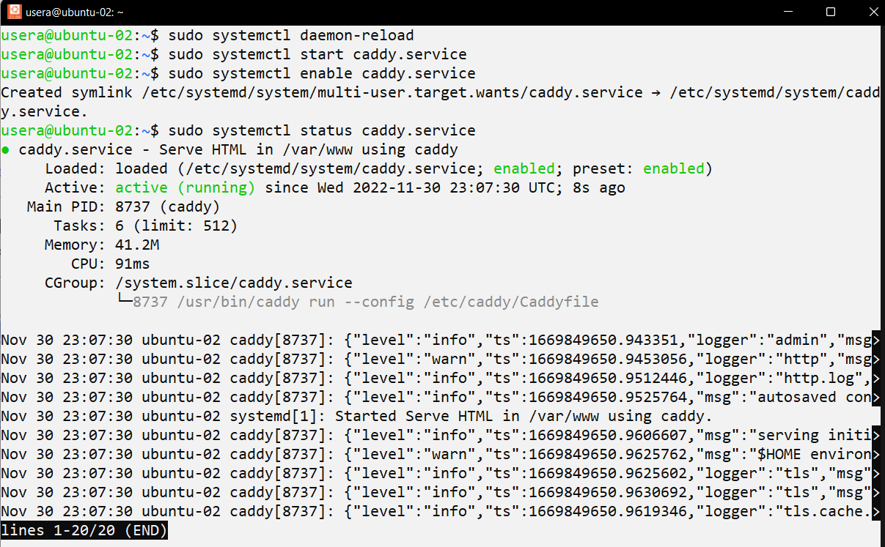

# ACIT 2420 - Assignment 2 

## Author: 
* **Amanda Chang**

---

**Load Balancer IP Address:** 164.90.245.229 
Visit my hello world api: http://164.90.245.229/ 

---

## Step 1. SetUp in DigitalOcean 
* Log in DigitalOcean and follow the steps below: 

### Create VPC Network 
1. Click **Networking** 
2. Click **VPC**  
3. Click **Create VPC Network** 
4. Select **SF03** as the datacenter, or select a datacenter that is close to your location 
5. Select **Generate an IP range for me**  
6. Name the VPC "vpc-2420"
7. Click **Create VPC Network** 

Your VPC is currently "No resources" 


### Create Two Droplets 
1. Select a Project 
2. Create Droplet 
3. Select 
* Datacenter: **SF03** 
* VPC Network: **vpc-2420**
* Select a **SSH Key** 
* Quantity: **2 Droplets**
* Tags: **web** 
* Hostname: **ubuntu-01 & ubuntu-02** 
* Click **Create Droplet** 

### Creat Load Balancer 
1. Click **Networking** 
2. Click **Load Balancers** 
3. Click **Create Load Balancer** 
4. Select **SF03** as the datacenter, or select the same datacenter as in the previous step 
5. Select **vpc-2420** as the VPC Network, it should show 2 droplets
6. Select **web** tag for Connect Droplets 
7. Click **Create Load Balancer** 

Your load balancer currently has no Healthy Droplets 


Note: Instead of visiting the IP address of the droplets, visit IP address of the load balancer, sfo3-load-balancer-01. 

### Create Firewall 
1. Click **Networking** 
2. Click **Firewalls** 
3. Click **Create Firewall** 
4. Name the firewall **fw-2420**
5. Add a new firewall rule to Inbound Rules with the following: 
* Type: HTTP 
* Sources: **sfo3-load-balancer-01** (Load Balancer)
6. Select **web** tag  
7. Click **Create Firewall** 

* Firewall fw-2420 has 2 droplets and 5 rules 


---

## Step 2 - Create New Regular Users on Both Droplets

* Both droplets can have the same user-name and password 

1. Log in server as root user `ssh -i ~/.ssh/FILE_NAME root@DIGITALOCEAN_DROPLET_IP_ADDRESS`
2. `useradd -ms /bin/bash USER_NAME` to create a regular user account 
3. `usermod -aG sudo USER_NAME` to assign the regular User with sudo privilege 
4. `passwd USER_NAME` create a password for the regular user 
5. `rsync --archive --chown=USER_NAME:USER_NAME ~/.ssh /home/USER_NAME`
6. `exit` 
7. Log in server as regular user `ssh -i ~/.ssh/FILE_NAME USER_NAME@DIGITALOCEAN_DROPLET_IP_ADDRESS`
8. Modify configuration file to disable root user from login 
- `sudo vi /etc/ssh/sshd_config`
- Change **PermitRootLogin** from "yes" to "no"
9. `sudo systemctl restart ssh`
10. Update and Upgrade 
- `sudo apt update && sudo apt upgrade` 

---

### Step 3 - Install Caddy (Web Server) on Both Droplets  

* Log in to your server with regular user account  

1. `wget https://github.com/caddyserver/caddy/releases/download/v2.6.2/caddy_2.6.2_linux_amd64.tar.gz`
2. `tar xvf caddy_2.6.2_linux_amd64.tar.gz` to unarchive the tar.gz file to get an executable caddy file  
3. `ls` 
* You should see the following: LICENSE  README.md  caddy  caddy_2.6.2_linux_amd64.tar.gz
4. `sudo cp caddy /usr/bin` to copy the caddy file to *bin* directory 
5. `sudo chown root:root /usr/bin/caddy`to change the caddy file's permission to root 


---

### Step 4 - Write "web app" (index.html and index.js) 

1. As a local host in your **wsl**, create a directory called **2420-assign-two** by using `mkidr 2420-assign-two`. 
2. Inside the **2420-assign-two** directory, create 2 new directories, **html** and **src**. 
* `cd 2420-assign-two` -> `mkdir html` -> `mkdir src` 


3. Inside the **html** directory, create an **index.html** file. 
* `cd html` -> `vim index.html` 

**Example of HTML** 
```HTML
<!DOCTYPE html>
<html lang="en">
<head>
        <meta charset="UTF-8">
        <meta http-equiv="X-UA-Compatible" content="IE=edge">
        <meta name="viewport" content="width=device-width, initial-scale=1.0">
        <title>ACIT 2420 Assignment Two</title>
</head>
<body>
        <h1>Hello World!</h1>
</body>
</html>
```

4. `cd ..` to go return to **2420-assign-two** directory. 
5. Inside the **src** directory, create a node project. 
* Run `npm init`-> Continue pressing ENTER -> Type "yes" (Refer to the screenshot below)
* Run `npm i fastify` to install fastify 
 


* Your **src** directory will have the following: 
* Note: Create a `.gitignore` file to prevent node_modules from git push to GitHub 


* After *fastify* is installed, the **package.json** will include *fastify*. 


6. Inside the **src** directory, create an **index.js** file with the following content: 
* Please Note: The **index.js** file requires alteration (2 changes to be changed) <br/>
Continue the following steps to see code alteration. 

```JS
// Require the framework and instantiate it
const fastify = require('fastify')({ logger: true })

// Declare a route
fastify.get('/', async (request, reply) => {
  return { hello: 'Server x' }
})

// Run the server!
const start = async () => {
  try {
    await fastify.listen({ port: 3000 })
  } catch (err) {
    fastify.log.error(err)
    process.exit(1)
  }
}
start()
```

7. To test server locally, run `node index.js` in src folder then copy and paste URL into your browser. 


8. Use `sftp -i ~/.ssh/KEY_FILE_NAME USER_NAME@DIGITALOCEAN_DROPLET_IP_ADDRESS` and `put -r FOLDER_NAME` to upload **html** and **src** folders to both droplets. 


---

### Step 5 - Caddyfile and caddy.service 

* As a local host in your **wsl**, create a **Caddyfile** inside the **2420-assign-two** directory. 

```Script  
# Reverse Proxy Server forwards localhost:5050 (http:/127.0.0.1:5050)

http:// {
        root * /var/www
        reverse_proxy /api localhost:5050
        file_server
}
```

* Also, create a **caddy.service** file inside the **2420-assign-two** directory. 

```Script 
[Unit]
Description=Serve HTML in /var/www using caddy
After=network.target

[Service]
Type=notify
ExecStart=/usr/bin/caddy run --config /etc/caddy/Caddyfile
ExecReload=/usr/bin/caddy reload --config /etc/caddy/Caddyfile
	TimeoutStopSec=5
KillMode=mixed

[Install]
WantedBy=multi-user.target
```

---

### Step 6 - Install Node and npm with Volta on Both Droplets 
* npm will be installed with node  

1. Log in server with the regular user account `ssh -i ~/.ssh/FILE_NAME USER_NAME@DIGITALOCEAN_DROPLET_IP_ADDRESS`
2. Visit Volta Website at https://volta.sh/
3. Run `curl https://get.volta.sh | bash` 
* You may need to `exit` and log in again to continue next step 
4. Run `volta install node`
5. Run `source ~/.bashrc` 

**Screenshots of Node and npm Installation through Volta for Server 1**
* Repeat the steps for Server 2 


* Volta will add 2 lines of code to **.bashrc**, run `vim ~/.bashrc` to see where volta is and where volta will install node and npm. 


---

### Step 7 - Write Service File (hello_web.service) 

* As a local host in your **wsl**, create a **hello_web.service** file inside the **2420-assign-two** directory. 

* The service file will start the node application, restart node application on failure, and require a configure network. 

```Script 
[Unit]
Description=Start node application and Restart node application on failure
After=network-online.target
Wants=network-online.target

[Service]
ExecStart=/home/usera/.volta/bin/node /home/usera/src/index.js
Restart=on-failure
User=usera
Group=usera
RestartSec=10
TimeoutStopSec=90
SyslogIdentifier=hello_web

[Install]
WantedBy=multi-user.target
```

---

### Step 8

### Upload Server Block and Service Files 

* Use `sftp -i ~/.ssh/KEY_FILE_NAME USER_NAME@DIGITALOCEAN_DROPLET_IP_ADDRESS` and `put FILE_NAME` to upload **Caddyfile**, **hello_web.service**, and **caddy.service** files to both droplets. 


### Place Files to Correct Locations 

* Log in server with the regular user account `ssh -i ~/.ssh/FILE_NAME USER_NAME@DIGITALOCEAN_DROPLET_IP_ADDRESS`

#### Caddyfile 
1. `sudo mkdir /etc/caddy` to create **caddy** folder inside **/etc**
2. Move the **Caddyfile** to the **caddy** folder by using `sudo mv Caddyfile /etc/caddy`


#### caddy.service & hello_web.service 
1. Move **caddy.service** and **hello_web.service** to **/etc/systemd/system** 
* `sudo mv caddy.service /etc/systemd/system/`



#### index.html 
1. `sudo mkdir /var/www` to create **www** folder in **/etc**
2. Inside your **html** directory, move your html file to **/var/www/** by using `sudo mv index.html /var/www/` 


### index.js 
* Change the URL to `/api` 
* Change the port to 5050 

```JS 
// Server 1 
const fastify = require('fastify')({ logger: true })

fastify.get('/api', async(request, reply) => {
        return { hello: "Server 1" }
})

const start = async () => {
        try {
                await fastify.listen({ port: 5050 })
        } catch (err) {
                fastify.log.error(err)
                process.exit(1)
        }
}
start()
```

```JS
// Server 2 
const fastify = require('fastify')({ logger: true })

fastify.get('/api', async(request, reply) => {
        return { hello: "Server 2" }
})

const start = async () => {
        try {
                await fastify.listen({ port: 5050 })
        } catch (err) {
                fastify.log.error(err)
                process.exit(1)
        }
}
start()
```

### Change HTML Contents for Server 1 and 2 

```HTML 
<!--HTML for Server 1-->
<!DOCTYPE html>
<html lang="en">
<head>
        <meta charset="UTF-8">
        <meta http-equiv="X-UA-Compatible" content="IE=edge">
        <meta name="viewport" content="width=device-width, initial-scale=1.0">
        <title>ACIT 2420 Assignment Two</title>
</head>
<body>
        <h1>Hello World!</h1>
        <h2>From Server 1 (ubuntu-01)</h2>
        <h3>By Amanda Chang<h3>
</body>
</html>
```

```HTML 
<!--HTML for Server 2-->
<!DOCTYPE html>
<html lang="en">
<head>
        <meta charset="UTF-8">
        <meta http-equiv="X-UA-Compatible" content="IE=edge">
        <meta name="viewport" content="width=device-width, initial-scale=1.0">
        <title>ACIT 2420 Assignment Two</title>
</head>
<body>
        <h1>Hello World!</h1>
        <h2>From Server 2 (ubuntu-02)</h2>
        <h3>By Amanda Chang<h3>
</body>
</html>
```

### Start Service Files (caddy.service and hello_web.service) 
* Replace SERVICE_NAME with **caddy** or **hello_web** 
1. `sudo systemctl daemon-reload`
2. `sudo systemctl start SERVICE_NAME.service`
3. `sudo systemctl enable SERVICE_NAME.service`
4. `sudo systemctl status SERVICE_NAME.service`

**Server 1**


**Server 2**



### Step 9 - Test Load Balancer 

1. To visit my hello world api: 
* Option 1: Type load balancer IP address listed below to your browser 
- **Load Balancer IP Address:** 164.90.245.229 
* Option 2: Click on the link http://164.90.245.229/ to directly access the browser 


